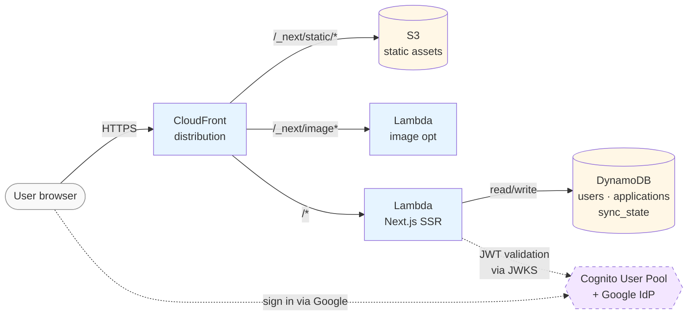

# jobtracker

Multi-tenant job-application tracker. Parses job-related Gmail threads with an LLM (Gemini) to auto-extract company, role, status, and dates into a personal dashboard. A working single-user prototype is being re-architected as a multi-tenant SaaS on AWS.

**Live:** [https://d2etjfsuqxfql6.cloudfront.net](https://d2etjfsuqxfql6.cloudfront.net) *(Stage 1 — placeholder page proving end-to-end CloudFront → Lambda → DynamoDB)*

## Architecture



Dashed line components (Cognito) are in progress for Stage 2.

## Repo layout

| Path | What it is |
|---|---|
| [`prototype/`](prototype/) | Original single-user app. Next.js + Google Sheets + Apps Script + Gemini. Deployed to Cloud Run, used daily. Frozen reference for the rewrite. |
| [`app/`](app/) | New multi-tenant rewrite. pnpm workspace; `apps/web/` is the Next.js 15 SSR app deployed to AWS Lambda. |
| [`infra/`](infra/) | Terraform for the AWS environment. Bootstrap → environments/dev → modules/{data,web,auth}. |
| [`docs/`](docs/) | Architecture Decision Records and design notes. |

## What's deployed today (Stage 1)

37 AWS resources, all managed by Terraform, costing under $1/month at idle:

| Layer | Resources |
|---|---|
| **State backend** | S3 bucket (`jobtracker-tfstate-209479264107`) with versioning + AES-256 + lifecycle cleanup, DynamoDB lock table |
| **Data** | 3 DynamoDB tables (`users`, `applications`, `sync_state`) — on-demand, PITR, deletion protection, GSI on `gmailThreadId` for dedup |
| **Compute** | 2 Lambda functions (SSR + image optimization), each with a Function URL, IAM roles scoped to the minimum |
| **Edge** | CloudFront distribution with 3 cache behaviors (static assets, image optimization, dynamic), Origin Access Control to a private S3 bucket |
| **Assets** | S3 bucket with all OpenNext build output uploaded as per-file objects with correct `Content-Type` + immutable cache headers |

## Decision records

Short Architecture Decision Records (ADRs) document the non-obvious choices and their tradeoffs:

- [ADR-0001 — Web hosting (Lambda + OpenNext, not App Runner)](docs/decisions/0001-web-hosting.md)
- [ADR-0002 — DynamoDB schema (multi-table, on-demand, PITR)](docs/decisions/0002-dynamodb-schema.md)
- [ADR-0003 — Lambda Function URL permissions](docs/decisions/0003-lambda-function-url-permissions.md)

## Stage roadmap

- **Stage 0 — Account cleanup** ✅ done
- **Stage 1 — Foundation** ✅ done *(folder restructure, Terraform bootstrap, DynamoDB tables, web tier on Lambda + CloudFront)*
- **Stage 2 — Multi-tenant core** in progress
  - Session A: Cognito + Google sign-in *(current)*
  - Session B: Gmail OAuth + KMS-encrypted refresh tokens per user
  - Session C: EventBridge → SQS → Lambda sync worker (Gmail + Gemini → DynamoDB)
  - Session D: Real dashboard UI
- **Stage 3 — Production polish** not started *(custom domain, monitoring, prod environment, privacy flows)*

## Running locally

The Next.js app:

```bash
cd app
pnpm install
pnpm --filter @jobtracker/web dev
# http://localhost:3001
```

Without AWS credentials configured locally, the user-count card on the home page shows "DB connection: not configured" — the app still renders.

Terraform changes (require `aws sts get-caller-identity` to work locally):

```bash
terraform -chdir="infra/environments/dev" init
terraform -chdir="infra/environments/dev" plan
```

See [infra/README.md](infra/README.md) for the bootstrap-first sequence.

## Technologies

AWS (Lambda, CloudFront, S3, DynamoDB, Cognito, IAM, CloudWatch, OAC) · Terraform · Next.js 15 · TypeScript · OpenNext · pnpm workspaces · Cost-aware infrastructure-as-code
